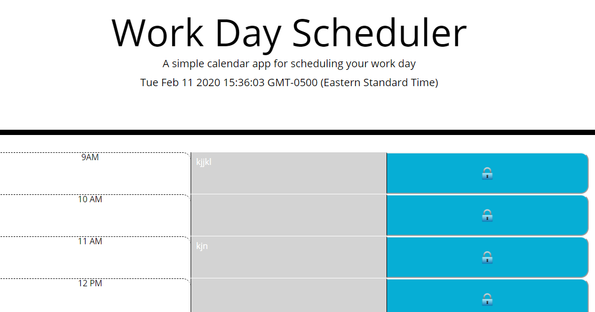

# daily planner read me

    japplication using javascript, css, html, jquery, to build a daily planner from 9-5. backgrounds change based on the currenttime to represent past, present and future. 

  
[link to deployed site](https://adriana-didden.github.io/Daily-Planner/)